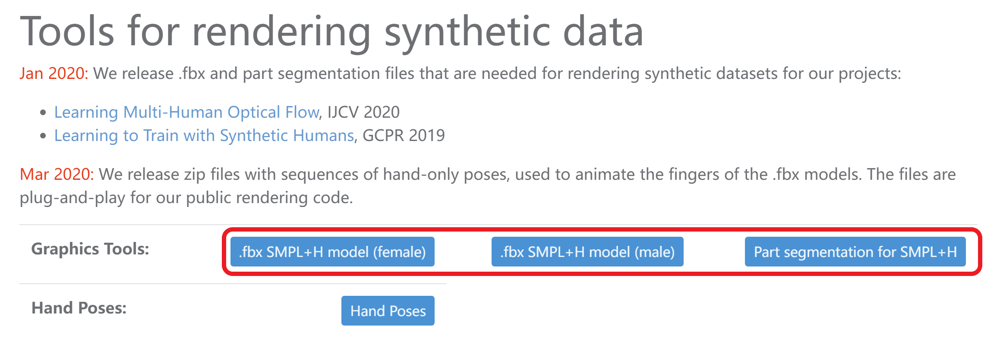
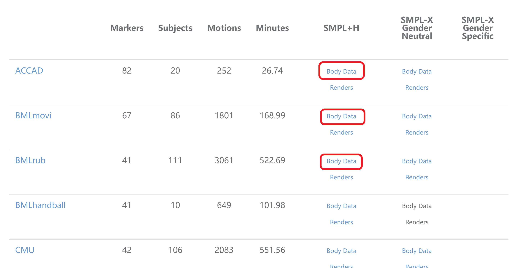
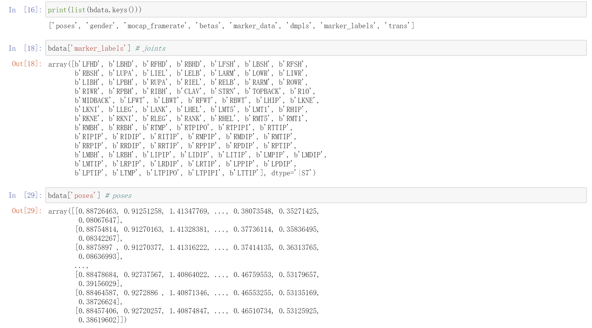

# Amass data

## Preparation

1. Get accounts for the websites

[MANO](https://mano.is.tue.mpg.de/en)

[AMASS](https://amass.is.tue.mpg.de/)

[SMPL](https://smpl.is.tue.mpg.de/)

2. Down the FBX models from [MANO downloads](https://mano.is.tue.mpg.de/downloads)



3. Get the Python npy data from [AMASS downloads](https://amass.is.tue.mpg.de/download.php)



4. Load Python npy data

```python
bdata = np.load(amass_npz_file)
```

And look at keys into **bdata**

