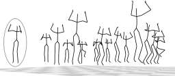
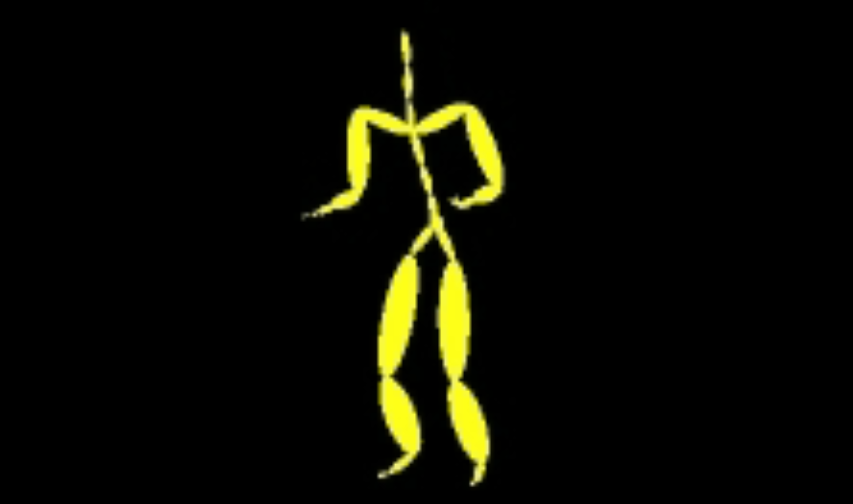

Dataset overview
========================

Large datasets are the essential for the success of recent advances in human motion synthesis using deep learning. There are many different available datasets from humam motion captures: they may use different rigging and parameterization of the body. Here, we list the datasets which are support in `GenMotion` for training, testing and sampling animation. 

HDM05      |HDM05_Licence|
##########################
.. |HDM05_Licence| image:: https://img.shields.io/badge/license-creative_commons-orange
   :target: https://creativecommons.org/licenses/by-sa/3.0/
   :alt: Licence

`HDM05 <http://resources.mpi-inf.mpg.de/HDM05/index.html>`_  contains more than three hours, more than 70 motion classes in 10 to 50 realizations executed by various actors of systematically recorded and well-documented motion capture data in the C3D as well as in the ASF/AMC data format.

Mocap CMU    |Mocap_Licence|
############################

.. |Mocap_Licence| image:: https://img.shields.io/badge/license--green
   :target: http://mocap.cs.cmu.edu/faqs.php
   :alt: Licence

`Mocap CMU (CMU Graphics Lab Motion Capture Database) <http://mocap.cs.cmu.edu/>`_ is a collection of various motion capture recordings (walking, dancing, sports, and others) performed by over 140 subjects. The database contains free motions which you can download and use.

AMASS Collection |Amass_Licence|
################################

.. |Amass_Licence| image:: https://img.shields.io/badge/license-non_commercial-red
   :target: https://amass.is.tue.mpg.de/license.html
   :alt: Licence

.. image:: ../images/amass.png
   :width: 400
   :alt: Amass

`AMASS (Archive of Motion Capture as Surface Shapes) <https://amass.is.tue.mpg.de/login.php>`_ is a large database of human motion unifying different optical marker-based motion capture datasets by representing them within a common framework and parameterization. AMASS is readily useful for animation, visualization, and generating training data for deep learning.

HumanAct12 |HumanAct12_Licence|
################################

.. |HumanAct12_Licence| image:: https://img.shields.io/badge/license-non_commercial-red
   :target: https://jimmyzou.github.io/publication/2020-PHSPDataset
   :alt: Licence

.. image:: ../images/humanact12.png
   :width: 400
   :alt: HDM05

`HumanAct12 <https://ericguo5513.github.io/action-to-motion/#data>`_ is a new 3D human motion dataset adopted from the polar image and 3D pose dataset PHSPD, with proper temporal cropping and action annotating. Statistically, there are 1191 3D motion clips(and 90,099 poses in total) which are categorized into 12 action classes, and 34 fine-grained sub-classes. The action types includes daily actions such as walk, run, sit down, jump up, warm up, etc. Fine-grained action types contain more specific information like Warm up by bowing left side, Warm up by pressing left leg, etc.

Human3.6m  |Human3.6_Licence|
#################################
.. |Human3.6_Licence| image:: https://img.shields.io/badge/license-academic_only-orange
   :target: http://vision.imar.ro/human3.6m/eula.php
   :alt: Licence

The `Human3.6M <http://vision.imar.ro/human3.6m/readme_challenge.php>`_ dataset is one of the largest motion capture datasets, which consists of 3.6 million human poses and corresponding images captured by a high-speed motion capture system. There are 4 high-resolution progressive scan cameras to acquire video data at 50 Hz. Human3.6M  is acquired by recording the performance
of 5 female and 6 male subjects, under 4 different viewpoints, for training realistic human sensing systems and for evaluating the next generation of human pose estimation models and algorithms.