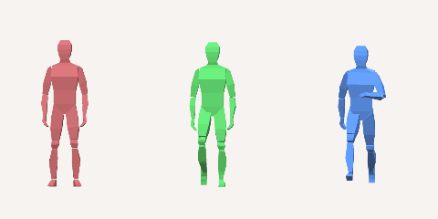
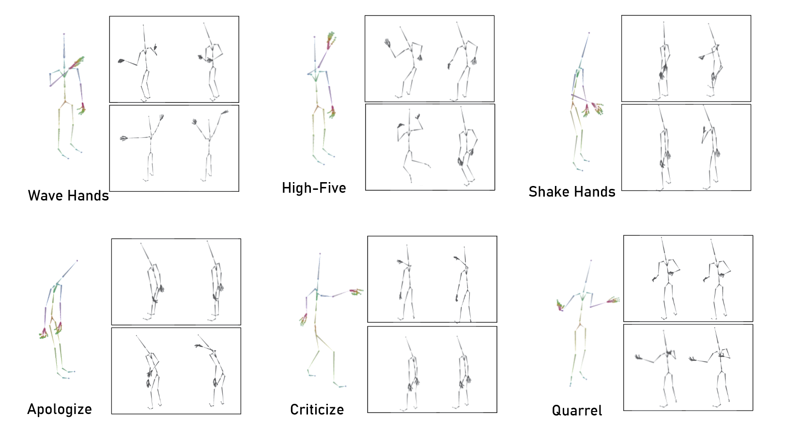
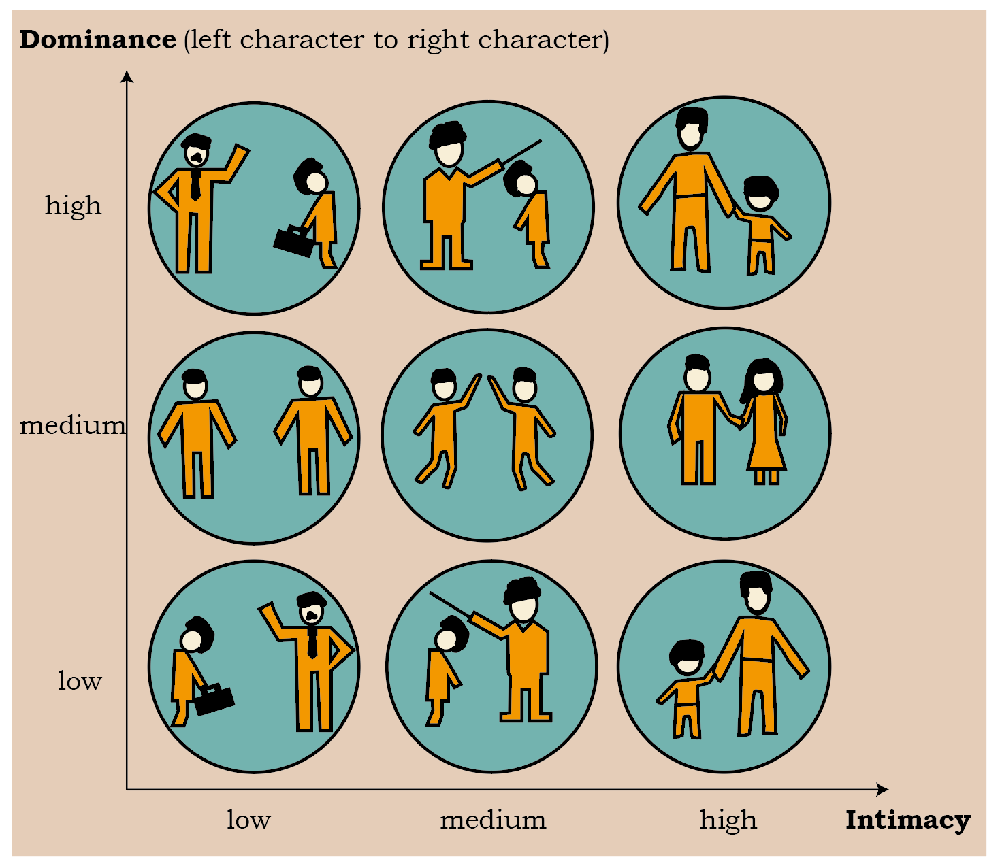

Welcome to GenMotion's documentation!
========================================

**GenMotion** (/gen'motion/) is a Python library for making skeletal animations.
We present a novel energy-based framework to sample and synthesize animations by associating the characters' body motions, facial expressions, and social relations. It also comes with a easy-to-use API.

The source code is available on `Github <https://https://github.com/yizhouzhao/GenMotion>`_

.. note::

   This project is under active development.

.. toctree::
   :maxdepth: 2
   :hidden:
   :caption: Getting Started

   installation

.. toctree::
   :maxdepth: 2
   :hidden:
   :caption: User Guide

   compatability
   genmotion_api 
   examples
   tutorials
   citation

Features of GenMotion
---------------------
Here are some of the features of GenMotion:

Motion Generation
^^^^^^^^^^^^^^^^^

Dramatic progress has been made in animating individual characters. 
However, we still lack automatic control over activities between characters, especially those involving interactions.

Emotion Generation
^^^^^^^^^^^^^^^^^^
.. image:: ../images/emotion.png
   :alt: Emotion image
   :width: 100%

Incorporating Social Relations
^^^^^^^^^^^^^^^^^^^^^^^^^^^^^^

Our  approach can be useful for the tasks including but not limitedto: i) assisting animators to make keyframe animations in-cluding character poses and facial expressions. ii) helpinggame developers generate vivid NPC interaction events; iii)offering better emotional intelligence for VR agents.