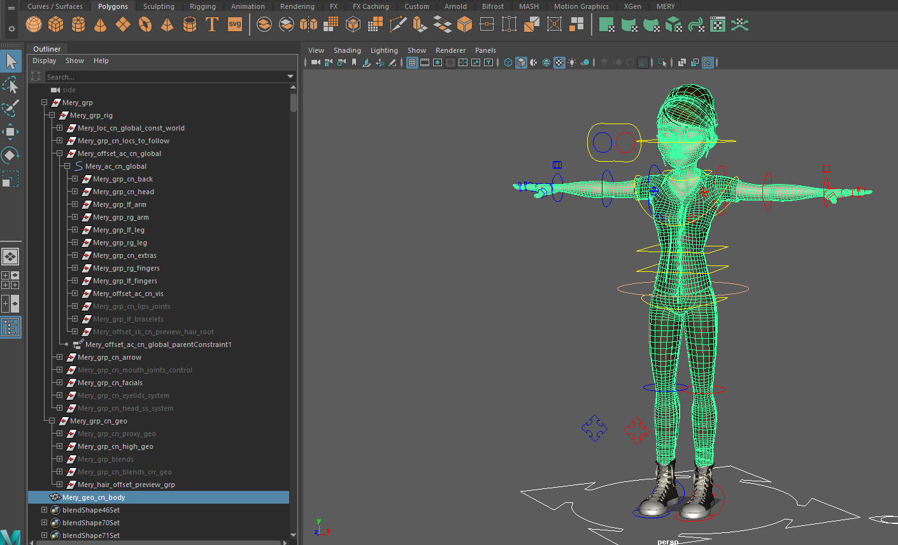
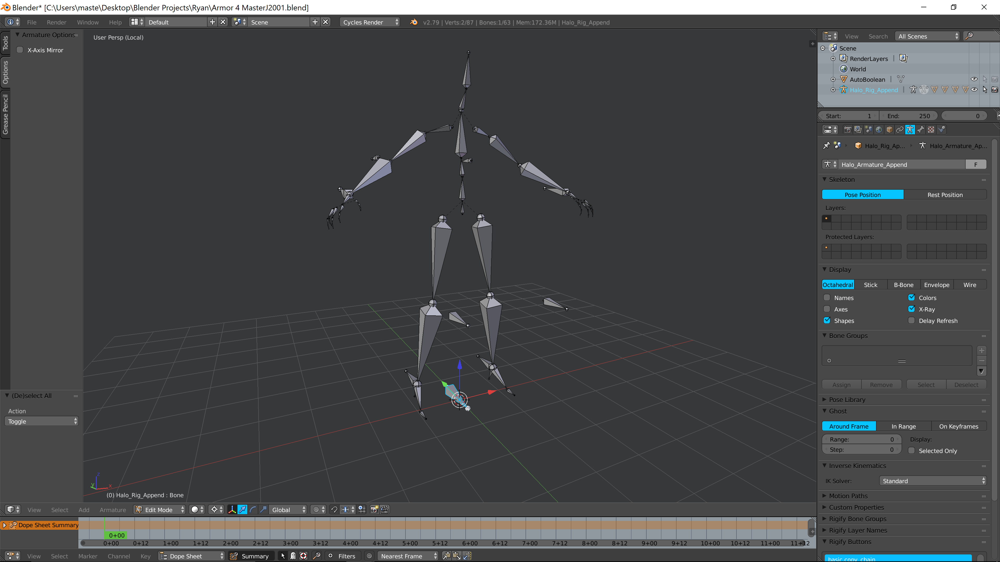
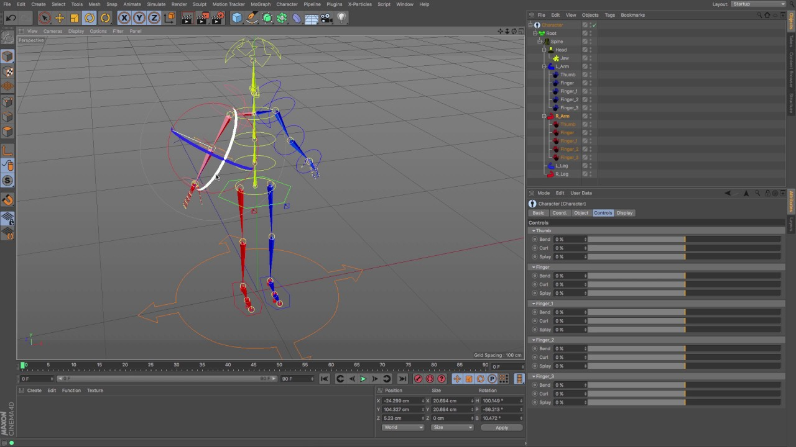

Render overview
===============================================

We provide a communication interface, i.e., client and server interaction, with
the 3D modeling software in GenMotion to achieve real-time animation rendering and
sampling. At present, 3D animation generated from deep-learning models can be rendered
in several popular character animation making tools: Autodesk Maya, Maxon Cinema
4D, and Blender.

Autodesk Maya
-------------

Maya is an application used to generate 3D assets for use in film, television, games, and commercials. 
Users define a virtual workspace (scene) to implement and edit media of a particular project. 
Maya is one of the most popular tools for rendering in film, animation, and arts industry. 

Blender
-------

Blender is a free and open-source 3D computer graphics software toolset used for creating animated films, visual effects, art, 
3D printed models, motion graphics, interactive 3D applications, virtual reality, and computer games. 
Blender's features include 3D modeling, UV unwrapping, texturing, raster graphics editing, rigging and skinning, fluid and smoke simulation, 
particle simulation, soft body simulation, sculpting, animating, match moving, rendering, motion graphics, video editing, and compositing.
As a open software it has gained a lot of attention in recent years. GenMotion provides the API to interact with blender via the blender-notebook
kernel.

Cinema4D
--------

Cinema 4D is a professional 3D modeling, animation, simulation and rendering software solution. Its fast, 
powerful, flexible and stable toolset make 3D workflows more accessible and efficient for design, motion graphics, 
VFX, AR/MR/VR, game development and all types of visualization professionals. 
GenMotion also supports rendering your generated motion in Cinema4D.

Python
------
While mainstream rendering software is supported by GenMotion, there are some researchers who simply prefer to use just 
Python for motion systhesis visualization and testing. GenMotion also has this covered by using the PyRender and ImageIO library of Python.
User can benefit from the rich API of GenMotion to inpect the systhesized motion without the need to configure other rendering software.