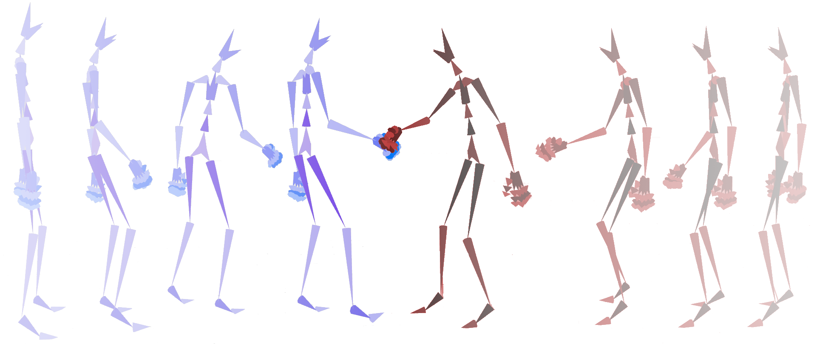

*********
GenMotion
*********

.. image:: https://github.com/yizhouzhao/genmotion/actions/workflows/CI.yml/badge.svg?branch=main
   :target: https://github.com/yizhouzhao/genmotion/actions/workflows/CI.yml
   :alt: CI

.. image:: https://readthedocs.org/projects/genmotion/badge/?version=latest
   :target: https://genmotion.readthedocs.io/en/latest/?badge=latest
   :alt: Documentation Status

.. image:: https://img.shields.io/pypi/v/genmotion
   :target: https://pypi.org/project/genmotion/
   :alt: PyPI
   
.. image:: https://img.shields.io/github/license/yizhouzhao/genmotion
   :target: https://choosealicense.com/licenses/mit/
   :alt: Licence
   

`GenMotion` (/gen’motion/) is a Python library for making skeletal animations. 
It enables easy dataset loading and experiment sharing for synthesizing skeleton-Based human animation with the Python API. It also comes with a easy-to-use and industry-compatible API for `Autodesk Maya <https://www.autodesk.com/products/maya/overview?term=1-YEAR&tab=subscription>`_,
`Maxon Cinema 4D <https://www.maxon.net/en/cinema-4d>`_, and `Blender <https://www.blender.org/>`_.

You can find the full ducumentation and tutorials `here <https://genmotion.readthedocs.io/en/latest/>`_.

.. contents:: **Contents of this document:**
   :depth: 2

Installation
============

You can install ``GenMotion`` directly from the pip library with:

.. code:: shell

    pip3 install genmotion

Library overview
================

Working with datasets
---------------------
We integrate multiple skeleton-based human motion datasets in GenMotion.
For datasets that have different parameterization of the body, we include 
documents for meta-data descriptions and visualization tools to illustrate characteristics of each dataset.

Benchmarking the state-of-the-arts
----------------------------------
To encourage related research in human motion generation and retrieve empirical results from most advanced methods,
GenMotion re-produces the training procedure of character motion generation methods by reusing and cleaning the code from official implementation.

Rendering
---------
To achieve real-time animation sampling, we provide communication interface, i.e. client and server interaction,  
with the 3D modeling software in GenMotion.

Coverage
========

Rendering Tools x Datasets
--------------------------

+---------------+---------------+---------------+---------------+
|               | Maya          | C4D           | Blender       |
+===============+===============+===============+===============+
| HDM05         | ✓             |               | ✓             |
+---------------+---------------+---------------+---------------+
| Mocap         | ✓             |               |               |
+---------------+---------------+---------------+---------------+
| Human3.6m     |               |               |               |
+---------------+---------------+---------------+---------------+
| Social        |               |               |               |
+---------------+---------------+---------------+---------------+
| NTU rgbd      |               |               |               |
+---------------+---------------+---------------+---------------+
| AMASS         | ✓             |               | ✓             |
+---------------+---------------+---------------+---------------+
| Mixamo        | ✓             |               | ✓             |
+---------------+---------------+---------------+---------------+

Model x Dataset
---------------

+--------------------+-----------+-----------+-----------+-----------+-----------+-----------+-----------+
|                    | HDM05     | Mocap     | Human3.6m | Social    | TU rgbd   | AMASS     | Mixamo    | 
+--------------------+-----------+-----------+-----------+-----------+-----------+-----------+-----------+
|Motion VAE          |           |           |           |           |           |           |           |
+--------------------+-----------+-----------+-----------+-----------+-----------+-----------+-----------+
|Motion Transformer  |           |           |           |           |           |           |           |
+--------------------+-----------+-----------+-----------+-----------+-----------+-----------+-----------+
|Motion RNN          |           |           |           |           |           |           |           |
+--------------------+-----------+-----------+-----------+-----------+-----------+-----------+-----------+
|Motion VRNN         |           |           |           |           |           |           |           |
+--------------------+-----------+-----------+-----------+-----------+-----------+-----------+-----------+
|MoGlow              |           |           |           |           |           |           |           |
+--------------------+-----------+-----------+-----------+-----------+-----------+-----------+-----------+
|MT-VAE              |           |           |           |           |           |           |           |
+--------------------+-----------+-----------+-----------+-----------+-----------+-----------+-----------+

